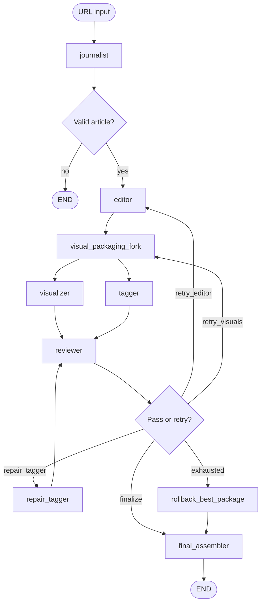

# LOQO: Dynamic broadcast screenplay generator

LOQO turns a **public news article URL** into a **60–120 second** TV-style package: anchor narration, timed segments, on-screen headlines, layout hints, and either **source image URLs** or **AI image prompts**. Orchestration uses **LangGraph**; language calls use a provider-agnostic utility (**`llm_utils.py`**) with layered fallbacks: **Groq** (`llama-3.3-70b-versatile`) $\rightarrow$ **Gemini** $\rightarrow$ **Sarvam AI**. Article text and images are pulled with a **tiered scraper** before any script is written. Built-in **Best-of-N selection** ensures the highest-scoring iteration is used even under heavy rate limits.

This repo covers **planning and structured output only** (no video render, TTS, or image generation).

---

## What runs in the pipeline

| Stage | Module | Role |
|--------|--------|------|
| Extract & ground | `journalist.py` + `scraper_utils.py` | Fetch HTML, extract text/images (trafilatura / newspaper3k, Playwright fallback), optional LLM cleanup, guardrails for thin or error-like pages |
| Script | `editor.py` | Single continuous anchor narration (target ~160–320 words) |
| Parallel packaging | `visualizer.py`, `tagger.py` | **Visualizer**: JSON segments with times, layout, `text`, image URL or AI prompt. **Tagger**: matching `headline`, `subheadline`, `top_tag` list |
| Deterministic sync | `evaluation/pipeline.py` (`validate_parallel`) | JSON/schema, segment count match, timecodes, duration window—before package LLM judges |
| Rubric evaluation | `evaluation/` | Per-metric scores (code + Groq judges, temp 0, JSON); **`evaluate_journalist`** then **`evaluate_package`** (editor, visualizer, tagger, cross-package) |
| Merge | `main.py` (`final_assembler`) | Writes tag fields into each segment dict |
| Output | `main.py` | Console screenplay + `final_broadcast_plan.json` + `evaluation_report.json` |

Canonical metric spec: **`docs/STRICT_EVALUATION_SPEC.md`**. Policy: **`config/evaluation_policy.yaml`**. Rubric: **`config/evaluation_rubric.yaml`** (run **`python gen_rubric.py`** to regenerate). Summary: **`PROJECT_REPORT.md`**.

**GitHub (placeholder):** add your public repo URL in `PROJECT_REPORT.md` when ready.

---

## Architecture (LangGraph)



**Conditional routing (`main.py`):**

- **Leader-Follower Authority**: Visualizer is the canonical owner of segment counts. The Tagger is a follower; structural mismatches trigger a surgical `repair_tagger` node rather than a full visual re-plan.
- **Surgical Repairs**: Feedback packets are machine-readable JSON, allowing tools to fix specific segment gaps or tag-count errors without regenerating the entire broadcast.
- **Best-of-N Recovery**: The pipeline tracks the highest-scoring state across all iterations (`best_package_state`). If retry budgets are exhausted, it rolls back to the "best attempt" rather than failing with the last (likely worse) attempt.
- **Auto-Routing**:
  - **PASS** → `final_assembler` → **END**
  - **FAIL & Structural Error** → `repair_tagger` (targeted fix)
  - **FAIL & Visual Error** → `retry_visuals` (re-runs Visualizer + Tagger)
  - **FAIL & Iterations Exhausted** → `rollback_best_package` → Finalize

**State:** `state.py` defines `AgentState` (including `iterations: Annotated[int, operator.add]` so retries accumulate correctly).

**Observability:** `run_industry_pipeline` passes `langfuse.langchain.CallbackHandler()` into `app.invoke(..., config={"callbacks": [...]})` when you use Langfuse env vars.

---

## Scraper behavior (`scraper_utils.py`)

1. **HTTP:** `requests` with a browser-like `User-Agent`.
2. **Main text:** `trafilatura` on the HTML; if missing or very short, **Playwright** loads the page and trafilatura runs again.
3. **Still thin:** **newspaper3k** parses the same HTML for body, title, and images.
4. **Metadata / images:** trafilatura metadata first; newspaper fills gaps.

There is **no** BeautifulSoup path in the production scraper (only in older scratch tests). The README does **not** claim “regex button clickers”; expansion of “Read more” is not implemented in the current scraper.

**Journalist guardrails:** Combined checks on scraped length, plus error-like substrings in the LLM output (`404`, `Page Not Found`, etc.), set `ERROR: INVALID_CONTENT` and stop the graph.

---

## Setup

```bash
pip install -r requirements.txt
playwright install chromium
```

**Environment (`.env`):**

```env
GROQ_API_KEY=key1,key2... (Multi-org rotation)
GEMINI_API_KEY=...
SARVAM_API_KEY=... (India-AI Fallback)
SARVAM_MODEL=sarvam-105b (Optional override)
LANGFUSE_SECRET_KEY=...
```

Copy `.env` locally; it is listed in `.gitignore`.

---

## Run

```bash
python main.py
```

or

```bash
python app.py
```

Both prompt for a URL and call `run_industry_pipeline`.

---

## Output schema (`final_broadcast_plan.json`)

Top level:

- `article_url`, `source_title`, `video_duration_sec`, `segments`
- `evaluation_results`, `evaluation_trace`, `rubric_version`, `policy_version`, `review_scores`

**`evaluation_report.json`** holds a focused snapshot: trace, per-agent merged scores, and review summary.

Each **segment** (after merge) typically includes:

- `segment_id`, `start_time`, `end_time`, `layout`, `text` (narration for that beat)
- `source_image_url`, `ai_support_visual_prompt`
- `headline`, `subheadline`, `top_tag` (from tagger)

Field names may differ slightly from an external PDF spec (e.g. `text` vs `anchor_narration`); align your video pipeline to this repo’s actual keys or add a thin mapping layer.

---

## Utilities

- **`verify_scraper.py`** – Smoke-test `scrape_article()` on URLs.

---

## Repository layout

| File | Purpose |
|------|---------|
| `main.py` | Graph definition, Best-of-N rollback, surgical repair nodes |
| `llm_utils.py` | Multi-provider dispatcher (Groq -> Gemini -> Sarvam), JSON repair, quota steering |
| `state.py` | `AgentState` including `best_package_score` and state tracking |
| `journalist.py` | Scrape + LLM structuring + guardrails |
| `editor.py` | Narration script |
| `visualizer.py` | Segment JSON from narration + images |
| `tagger.py` | Per-segment headlines/tags JSON |
| `evaluation/` | Rubric load, deterministic checks, Groq judges, aggregate, pipeline steps |
| `reviewer.py` | Deprecated (use `evaluation/`; do not wire in graph) |
| `scraper_utils.py` | Tiered fetch/extract |
| `gen_rubric.py` | Generates `config/evaluation_rubric.yaml` |
| `PROJECT_REPORT.md` | Evaluation methodology and policy summary |
| `app.py` | CLI wrapper around `run_industry_pipeline` |
| `task.md` | Original product / assignment spec (reference) |

---

## Implementation narrative

See **`IMPLEMENTATION_JOURNEY.md`** for a phase-style description (roughly 0–100%) of how the design evolved: sequential → tiered scraping → parallel visual packaging → reviewer with targeted retries and iteration caps.
