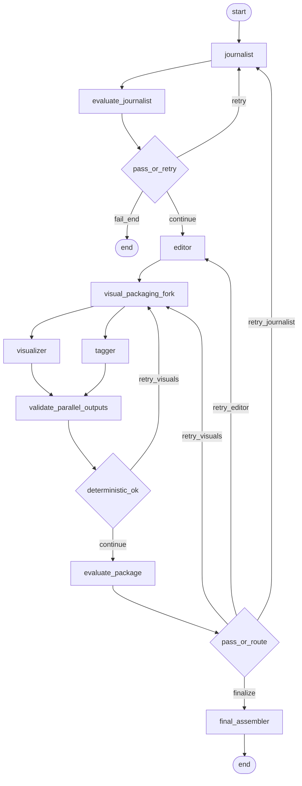

# Strict multi-metric evaluation and retry architecture

## Current gaps (why HR feedback applies)

| Area             | Issue in codebase                                                                                                                                                                                                                                                                                 |
| ---------------- | ------------------------------------------------------------------------------------------------------------------------------------------------------------------------------------------------------------------------------------------------------------------------------------------------- |
| Scope            | Only `[reviewer.py](C:\Users\HP\.cursor\worktrees\News_OTT\skh\reviewer.py)` scores the **whole package** with **5 coarse dimensions**; no per-agent accountability.                                                                                                                              |
| Journalist       | `[journalist.py](C:\Users\HP\.cursor\worktrees\News_OTT\skh\journalist.py)` is only guarded by length + substring errors; **no fidelity or craft scoring** before the editor runs.                                                                                                                |
| Parallel outputs | `[visualizer.py](C:\Users\HP\.cursor\worktrees\News_OTT\skh\visualizer.py)` vs `[tagger.py](C:\Users\HP\.cursor\worktrees\News_OTT\skh\tagger.py)` can disagree on **segment count**; nothing validates alignment before `[final_assembler](C:\Users\HP\.cursor\worktrees\News_OTT\skh\main.py)`. |
| Retries          | `[editor.py](C:\Users\HP\.cursor\worktrees\News_OTT\skh\editor.py)` ignores prior `review_scores`; **no injected failure evidence** or metric-level fixes.                                                                                                                                        |
| Routing          | `[should_continue](C:\Users\HP\.cursor\worktrees\News_OTT\skh\main.py)` trusts LLM `failure_type` strings; **fragile** vs a **data-driven** `retry_targets[]` from rubric.                                                                                                                        |
| Tracking         | `[state.py](C:\Users\HP\.cursor\worktrees\News_OTT\skh\state.py)` has no **evaluation history** or **per-round deltas**.                                                                                                                                                                          |

---

## Design principles (aligned with your choice: strict thresholds, natural 1-3 retries)

1. **Two-layer scoring per agent**
  - **Deterministic / programmatic** metrics (cheap, reproducible): JSON/schema validity, word counts, timecode monotonicity, segment alignment, URL format checks, forbidden substring lists, etc.  
  - **Domain + prompting craft** metrics (LLM-as-judge): scored on a fixed rubric loaded from config, **temperature 0**, **JSON-only** output with **evidence strings** per sub-score.
2. **Rubric source of truth (not hardcoded magic)**
  - Add `[config/evaluation_rubric.yaml](config/evaluation_rubric.yaml)` (or `.json`): for each agent, list **20-25 metric IDs**, human-readable names, **group** (`domain` | `prompting`), **weight**, **critical** (bool: fail-closes gate), **min_score**, and optional **evaluator** hint (`code` | `llm` | `hybrid`).  
  - Add `[config/evaluation_policy.yaml](config/evaluation_policy.yaml)`: global **pass rule** (e.g. weighted average, no critical fail, no score below floor), **max_graph_iterations** (keep compatible with LangGraph reducer), optional caps per agent.
3. **Metric taxonomy (universal broadcast news orientation)**
  - **Domain** (examples; full set lives in YAML): source fidelity vs scraped body, lead/structure appropriateness, fairness / absence of invented claims, timing and segment coherence, chyron readability, visual-story alignment, tag honesty (BREAKING vs DEVELOPING), etc.  
  - **Prompting / craft**: instruction adherence, structured output validity, absence of meta-phrasing (“this article”), consistency of JSON fields, anti-hallucination signals (cross-check vs `article_text` / raw scrape where available).
   *Note:* Reaching **literally 25 LLM-scored scalars per agent** in one call is workable via a **single structured JSON schema** per agent; some of the “25” should be **deterministic** so the rubric stays honest and costs stay bounded.
4. **Per-agent evaluation modules**
  - New package e.g. `[evaluation/](C:\Users\HP\.cursor\worktrees\News_OTT\skh\evaluation\)`:  
    - `load_rubric.py` – load and validate YAML.  
    - `deterministic_checks.py` – implement code-side metrics (schema, counts, times).  
    - `llm_judge.py` – one function per agent: `evaluate_journalist`, `evaluate_editor`, `evaluate_visualizer`, `evaluate_tagger`, `evaluate_cross_package` (optional cross-cutting: alignment between branches).  
    - `aggregate.py` – combine deterministic + LLM scores → **pass/fail**, `**retry_targets`**, `**blocking_metrics**`, **weighted totals**.  
    - `trace.py` – append round record, compute **delta vs previous round** for each metric group.
5. **State extensions** (`[state.py](C:\Users\HP\.cursor\worktrees\News_OTT\skh\state.py)`)
  - `evaluation_trace`: list of `{round, stage, agent, metrics, deterministic_results, llm_results, pass, retry_targets, notes}`.  
  - `last_feedback_by_agent`: dict of concise **fix instructions** derived from failing metrics (for next prompt).  
  - `raw_article_text` or `scrape_snapshot`: optional copy of pre-LLM scrape for **faithfulness checks** (journalist/editor judges compare output to this + URL).  
  - Keep `iterations` reducer; tie **graph-level** retry cap to policy file.
6. **Graph changes** (`[main.py](C:\Users\HP\.cursor\worktrees\News_OTT\skh\main.py)`)
  - After **journalist**: new node `evaluate_journalist` → conditional edge: **retry journalist** (same node with feedback) vs **continue to editor** vs **END** on unrecoverable scrape.  
  - After **visual_packaging_fork** completes both branches: `**validate_parallel_outputs`** (pure function node): if segment counts mismatch or deterministic checks fail **before** expensive LLM judges, route to **retry_visuals** with specific feedback (no silent merge).  
  - Replace monolithic `reviewer` with **staged evaluators** or one **orchestrator** that runs per-agent evaluations and sets `retry_targets` (can be one node internally calling sub-evaluators to avoid LangGraph explosion).  
  - **Routing**: derive `retry_editor` / `retry_visuals` / `retry_journalist` from `**retry_targets`** and policy, not only free-form `failure_type`.  
  - **Feedback injection**: pass `state["last_feedback_by_agent"]["editor"]` into `[editor.py](C:\Users\HP\.cursor\worktrees\News_OTT\skh\editor.py)` prompt; same for journalist, visualizer, tagger.
7. **Agent prompt revisions** (line-by-line pass)
  - **Journalist**: preserve scrape; add “do not invent facts”; on retry, inject failing metric summaries.  
  - **Editor**: include reviewer feedback + metric bullets; optional shortened `article_text` if token limits bite.  
  - **Visualizer / Tagger**: on retry, require **explicit segment count** matching narration beats or accept script hash / beat list from a prior deterministic step to reduce drift.
8. **Output artifacts**
  - Extend `[final_broadcast_plan.json](C:\Users\HP\.cursor\worktrees\News_OTT\skh\main.py)` (or add `evaluation_report.json`) with **full trace** and **final metric snapshot** for audit (HR-friendly).
9. **Documentation**
  - Add `**PROJECT_REPORT.md`**: executive summary, problem statement, architecture (include your LangGraph screenshot concept as an exported figure or embedded Mermaid), **full metric appendix** (tables from YAML), methodology (deterministic vs LLM judge), limitations (judge variance, no legal/compliance certification), **retry policy**, and **Repository** section with **canonical GitHub URL** (you will supply the link; repo has no remote in-tree—use a placeholder until set).  
  - Update `[README.md](C:\Users\HP\.cursor\worktrees\News_OTT\skh\README.md)` with a short pointer to the report + evaluation config.
10. **Optional assets**
  - Your pipeline diagrams (LangGraph UI + scraper flow) can be copied into `docs/assets/` and referenced from `PROJECT_REPORT.md` for a polished report.

---

## Target graph (high level)

*(Exact node split can compress `evaluate_journalist` + `evaluate_package` into fewer LangGraph nodes if you prefer fewer graph edges; logic stays the same.)*

---

## Risks and mitigations

| Risk                                | Mitigation                                                                                                         |
| ----------------------------------- | ------------------------------------------------------------------------------------------------------------------ |
| LLM judges disagree with each other | Deterministic gates first; critical metrics; temperature 0; optional duplicate judge only on borderline.           |
| Cost/latency                        | Batch per-agent metrics in **one JSON response**; cache scrape text; skip LLM for metrics already decided in code. |
| Rubric size                         | Version the YAML (`rubric_version` in output JSON).                                                                |

---

## Implementation order (suggested)

1. Rubric YAML + policy YAML + state fields + trace helpers (no graph change yet).
2. Deterministic checks + parallel-output validator.
3. Per-agent LLM judges + aggregation + replace `[reviewer.py](C:\Users\HP\.cursor\worktrees\News_OTT\skh\reviewer.py)` content or wrap it.
4. Wire LangGraph + feedback into agents.
5. JSON export + `PROJECT_REPORT.md` + README + GitHub link line.

